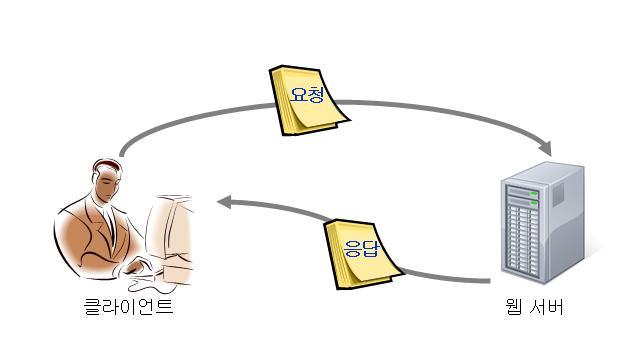

# chapter1 왜 서블릿을 사용하는가?

## 학습목표

서블릿의 등장 배경을 이해 함으로써 서블릿을 왜 사용하는지 이해한다.

### 1. web(world wide web)이란

web이란 인터넷으로 연결 된 사용자들이 서로의 정보를 공유 할 수 있도록 하는 공간이다. web이라는 공간에서 web service가 이루어진다.

### 2. web service의 구성

web service는 클라이언트와 서버로 구성된다. 클라이언트는 서버에게 요청을 보내고 서버는 클라이언트 요청에 대한 응답을 보내줌으로써 서버의 자원을 제공해준다.

### 3. 클라이언트와 서버는 어떻게 통신하는가?

web이라는 환경에서 클라이언트와 서버는 HTTP(HyperText Transfer Protocol)를 통해서 통신한다. 클라이언트가 보내는 요청을 request라고 하고 서버가 보내는 응답을 response라고 한다.

request에는 기본적으로 어디서(where) 무엇(what)을 어떻게(how) 할 것인가에 대한 정보가 있어야 한다. (who에 대한 정보도 있을 수 있지만 web에 대한 설명을 위한 글이기에 생략한다.) 어디서 무엇에 대한 정보는 uri에 있다. uri의 도메인 혹은 ip 주소는 요청을 처리 해줄 서버가 어디에 있는지 표시한다. 그리고 uri의 path는 내가 필요로 하는 자원이 무엇인지 표시한다. 그리고 header의 method를 통해서 해당자원을 어떻게 할 것인지 표시한다. how에 대한 추가적은 표시는 header와 body에 추가적으로 표시 할 수 있다.

예를 들어 https://gyujinan.github.io/k8s/2021/11/22/servlet-01.html 이라는 요청은 gyujinan.github.io 부분은 요청에 대한 처리를 할 수 있는 서버가 무엇인지를 의미한다. /k8s/2021/11/22/servlet-01.html 부분은 그 서버에 클라이언트가 원하는 자원이 서버 내부 어디에 있으며 무엇인지를 의미한다. start line의 Request Method: GET 해당 자원을 어떻게 할 것인지를 의미한다. 추가적으로 header의 accept: text/html 부분은 클라이언트가 처리 할 수 있는 데이터 형식을 의미한다. 서버는 해당 형식을 고려하여 요청을 처리하여야 한다. start line, header는 개발자도구(mac: option + command + i)를 통해 확인 할 수 있다. 

response에는 응답의 상태, 메타데이터, 내용에 대한 정보가 표시된다. 예를 들어 https://gyujinan.github.io/k8s/2021/11/22/servlet-01.html 대한 응답 상태는 start line에 Status Code: 200 와 같이 표시된다. 메타데이터는 여러개가 존재하지만 내용물에 대한 형식을 표시하는 content-type은 header에 content-type: text/html과 같이 표시된다. 해당 내용물은 html이므로 클라이언트(브라우저)는 내용을 html 형식으로 해석해야된다. 마지막으로 내용은 클라이언트(사용자)가 보고 있는 화면이 될 것이다.

위와 같이 web환경에서 web service는 클라이언트와 서버의 http통신에 의해 제공된다. 

### 4. web server의 한계와 극복

web service의 server를 web server라고 한다. 이러한 web server는 web server에 저장되어 있는 정적 데이터만을 취급 할 수 있다. 그리하여 요청시 동적으로 무엇가를 처리하고 싶다면 web server만으로는 불가능하다. 이러한 web server의 한계를 극복하기 위해 과거 개발자들이 개발한 것이 바로 servlet이다. servlet은 runtime시 클라이언트의 요청에 대한 로직을 바로 처리 할 수 있기에 요청에 대한 동적 처리가 가능하다.

## 핵심정리

과거 web service에서 web server는 요청에 대한 정적 데이터 처리만 가능하였다. web server에 추가적으로 동적처리를 할 수 있는 프로그램이 필요하게 되었는데 그리하여 servlet이 개발되었다. servlet은 요청이 발생한 시점부터 작동하여 클라이언트의 요청에 대한 동적처리를 해준다. 그리하여 다음 포스팅에서 이 servlet이 어떠한 구조에서 동작하는지를 포스팅 한다.